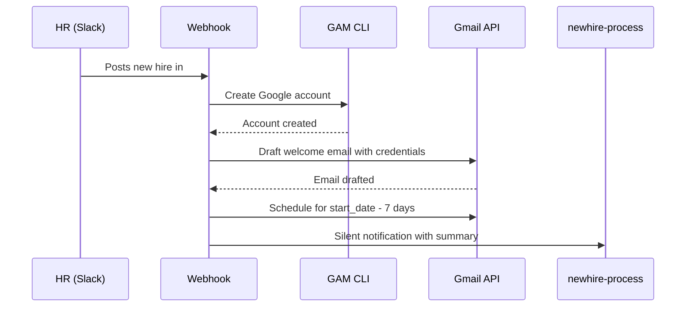
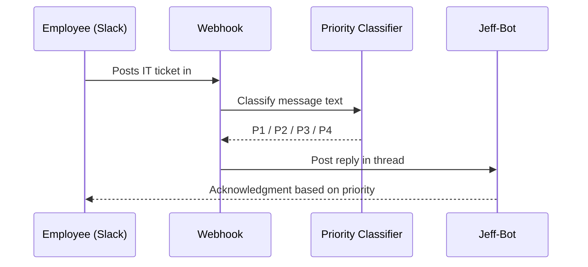

# Architecture

## System Overview

```mermaid
flowchart TD
    subgraph Slack["Slack (4 Workspaces)"]
        S1[help-it-kerma]
        S2[help-it-ngv]
        S3[help-it-surt]
        S4[help-it-trivelta]
        N1[newhires-kerma]
        N2[newhires-ngv]
        N3[newhires-surt]
        N4[newhires-trivelta]
    end

    subgraph Tunnel["Public Access"]
        NG[ngrok static domain\nyour-domain.ngrok-free.app]
    end

    subgraph Server["Mission Control — localhost:3000"]
        WH[/api/webhooks/slack]
        PC[Priority Classifier\nP1 / P2 / P3 / P4]
        TR[Ticket Recorder\nSQLite]
        NH[New Hire Handler]
    end

    subgraph Google["Google Workspace"]
        GAM[GAM CLI\ngam create user]
        GM[Gmail API\ndraft + schedule email]
    end

    subgraph Memory["Agent Memory"]
        GH[agent-47 repo\nGitHub markdown]
    end

    subgraph Notify["Notifications"]
        OP[newhire-process\nprivate Slack channel]
    end

    S1 & S2 & S3 & S4 -->|message event| NG
    N1 & N2 & N3 & N4 -->|message event| NG
    NG --> WH
    WH --> PC
    PC --> TR
    PC -->|auto-reply in thread| S1 & S2 & S3 & S4
    WH --> NH
    NH --> GAM
    GAM -->|creates account| Google
    NH --> GM
    GM -->|schedules welcome email\n7 days before start| Google
    NH --> OP
    OP -->|private notification| Notify
    WH --> GH
    GH -->|recalled each session| Memory
```

## New Hire Workflow



## IT Ticket Workflow


